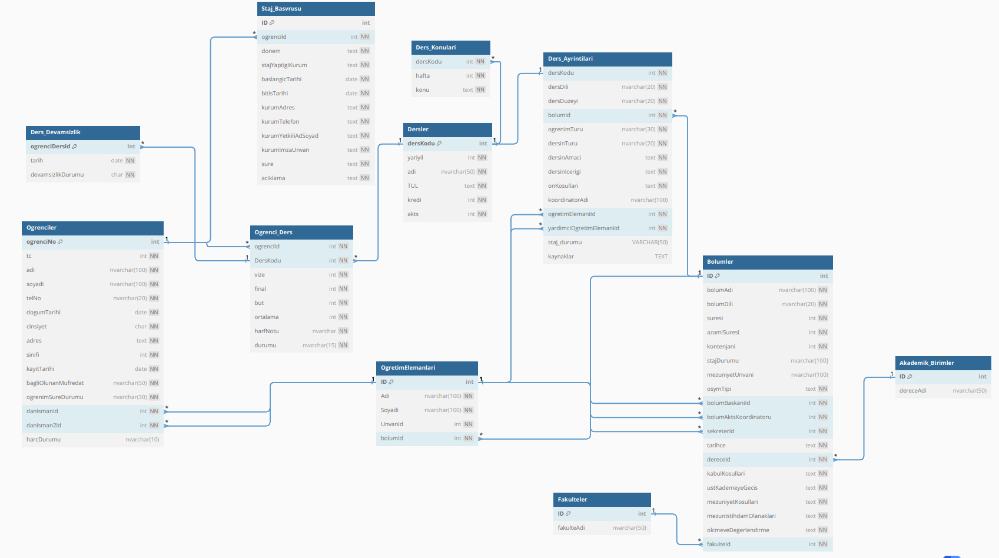

# Backend Project README

## Overview

This system is a backend solution for a student automation system, designed with security and ease of use in mind. The
system uses JWT tokens for security, ensuring that students cannot perform any actions without logging in. Unauthorized
users can only retrieve data, but cannot make any changes or post requests. Data entry is handled through a separate URL
or by directly uploading data to the database.

## How to Run

### Step 1: Start the Database

First, set up and run the PostgreSQL database using Docker. Execute the following command:

## Database Setup

To set up the PostgreSQL database, use the following Docker command:

```sh
docker run -d -e POSTGRES_HOST_AUTH_METHOD=trust -e POSTGRES_USER=backend -e POSTGRES_PASSWORD=backend -e POSTGRES_DB=backenddb -p 5432:5432 postgres:13
```

### Step 2: Run the Spring Boot Application

Ensure you have Java and Maven installed on your system. Navigate to the root directory of your Spring Boot application
and run the following commands:

```sh
mvn clean install
mvn spring-boot:run
```

## Database Schema

Below is the schema design for the PostgreSQL database used in this project:


# API Usage

## User Registration

To register a new user, send a POST request to`localhost:8080/register` with the following JSON payload:

```json
{
  "studentNumber": 201913171046,
  "tc": 10000000000,
  "firstName": "Emir Selim",
  "lastName": "Aktug",
  "email": "muhammetfatihaktug@gmail.com",
  "phoneNumber": "+1234567890",
  "birthDate": "2000-01-01",
  "gender": "M",
  "address": "123 Main St, Anytown, USA",
  "grade": 3,
  "registrationDate": "2020-09-01",
  "curriculum": "Computer Science",
  "studyDurationStatus": "Normal",
  "tuitionStatus": "Paid",
  "password": "1967",
  "role": "USER"
}
```

## Create Multiple Courses

To create multiple courses, send a POST request to `localhost:8080/courses/createAll` with the following JSON payload:

```json
[
  {
    "courseCode": 131711003,
    "semester": 1,
    "name": "Turkish language I",
    "description": "To understand the characteristics of language and its place in social life; To teach the historical periods of Turkish; To teach the phonetic and morphological structure of Turkish and to ensure the appropriate use of spelling and punctuation marks; To teach words in terms of their meanings and functions.",
    "credits": 2,
    "ects": 2
  },
  {
    "courseCode": 131711100,
    "semester": 1,
    "name": "Introduction to Computer Engineering",
    "description": "To give basic information about the subjects within the scope of Computer Engineering and to provide students with basic knowledge/concepts about the courses they will take during their undergraduate education.",
    "credits": 2,
    "ects": 4
  }
]

```

## Link Students to Courses and Enter Grades

To link students to courses and enter their grades, send a POST request to localhost:
`8080/studentCourses/201913171046/saveAll` with the following JSON payload:

```json
[
  {
    "course": {
      "courseCode": 131711003,
      "semester": 1,
      "name": "Turkish language I",
      "description": "To understand the characteristics of language and its place in social life; To teach the historical periods of Turkish; To teach the phonetic and morphological structure of Turkish and to ensure the appropriate use of spelling and punctuation marks; To teach words in terms of their meanings and functions.",
      "credits": 2,
      "ects": 2
    },
    "midterm": 50,
    "finalExam": 70,
    "makeup": 0,
    "average": 60,
    "letterGrade": "C",
    "status": "passed",
    "createdDate": "2020-2021"
  },
  {
    "course": {
      "courseCode": 131711100,
      "semester": 1,
      "name": "Introduction to Computer Engineering",
      "description": "To give basic information about the subjects within the scope of Computer Engineering and to provide students with basic knowledge/concepts about the courses they will take during their undergraduate education.",
      "credits": 2,
      "ects": 4
    },
    "midterm": 90,
    "finalExam": 85,
    "makeup": 0,
    "average": 87.5,
    "letterGrade": "B",
    "status": "passed",
    "createdDate": "2020-2021"
  }
]

```

## Record Absences for a Student

To record absences for a student, send a POST request to `localhost:8080/absences/saveAll` with the following JSON
payload:

```json
[
  {
    "studentNumber": 201913171046,
    "courseCode": 131711003,
    "date": "2024-06-17",
    "absenceStatus": true
  },
  {
    "studentNumber": 201913171046,
    "courseCode": 131711003,
    "date": "2024-06-18",
    "absenceStatus": false
  },
  {
    "studentNumber": 201913171046,
    "courseCode": 131711003,
    "date": "2024-06-19",
    "absenceStatus": true
  }
]
```

# User Authentication and Data Retrieval

## Login

To authenticate a user, send a POST request to `localhost:8080/login` with the following JSON payload:

```json
{
  "email": "muhammetfatihaktug@gmail.com",
  "password": "1967"
}
```

The server will respond with a JSON object containing the access and refresh tokens:

```json
{
  "access_token": "your_access_token",
  "refresh_token": "your_refresh_token"
}

```

## Retrieve User Information

To retrieve user information, send a GET request to `localhost:8080/user/info` with the access token in the
Authorization
header:

```http request
GET /user/info HTTP/1.1
Host: localhost:8080
Authorization: Bearer your_access_token
```

The server will respond with the user's information:

## Retrieve User Courses

```http request
GET /user/courses HTTP/1.1
Host: localhost:8080
Authorization: Bearer your_access_token
```

## Retrieve User Absences

```http request
GET /user/absences HTTP/1.1
Host: localhost:8080
Authorization: Bearer your_access_token
```

## Retrieve User GPA

```http request
GET /user/gpa HTTP/1.1
Host: localhost:8080
Authorization: Bearer your_access_token
```

## Retrieve GPA by Semester

```http request
GET /user/gpa/semester HTTP/1.1
Host: localhost:8080
Authorization: Bearer your_access_token

```

## Dependencies

- **Spring Boot Starter Data JPA**: Provides JPA functionalities for database operations.
- **Spring Boot Starter Security**: Manages authentication and authorization, providing a security layer.
- **Spring Boot Starter Web**: Essential module for web applications and RESTful services.
- **Spring Boot Starter Validation**: Ensures validation of Java Bean objects, maintaining data integrity.
- **PostgreSQL**: PostgreSQL database driver (version 42.6.2).
- **Java JWT**: Handles JWT (JSON Web Token) creation and verification (version 4.3.0).
- **JJWT API, JJWT Implementation, JJWT Jackson**: Libraries for managing JWT operations with JSON (version 0.11.5).
- **Jakarta Validation API**: Supports Jakarta Bean Validation standard (version 3.0.2).
- **Lombok**: Reduces boilerplate code and simplifies Java classes.
- **MapStruct, MapStruct Processor**: Facilitates easy data transformations between Java bean types (version
  1.5.3.Final).
- **Spring Boot Starter Test**: Framework for testing Spring Boot applications.
- **Spring Security Test**: Auxiliary test libraries for testing Spring Security components.

## License

This project is licensed under the [MIT License](LICENSE).
